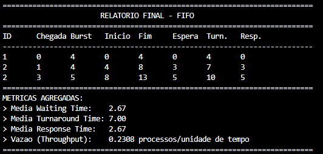

# Simulador de Escalonamento de Processos – FIFO

## Sobre o Projeto

Este repositório contém o desenvolvimento de um **simulador de escalonamento de processos utilizando o algoritmo FIFO (First In, First Out)**, elaborado como trabalho teórico-prático da disciplina **Estrutura de Dados**, do curso superior de Tecnologia em Sistemas para Internet, no Instituto Federal do Acre – Campus Rio Branco.

O projeto foi desenvolvido **em grupo**, com foco tanto na correta implementação do algoritmo quanto na compreensão prática das métricas de desempenho estudadas em Sistemas Operacionais.

---

## Objetivo Geral

Implementar um simulador funcional que execute processos seguindo o algoritmo FIFO e apresente, de forma clara, as métricas de desempenho individuais e globais do escalonador.

---

## Algoritmo FIFO (First In, First Out)

O FIFO é um algoritmo de escalonamento **não preemptivo**, no qual os processos são executados exatamente na ordem em que chegam ao sistema.

Principais características:

* Execução sequencial conforme a chegada
* Não ocorre interrupção de processos em execução
* Simples de implementar e compreender
* Pode gerar tempos de espera elevados em alguns cenários

---

## Decisões de Projeto

Durante o desenvolvimento do simulador, foram adotadas as seguintes decisões:

* Implementação exclusiva do algoritmo FIFO, conforme definido para o grupo
* Utilização de **fila dinâmica** baseada em lista encadeada
* Uso da linguagem C para maior controle sobre memória e estruturas de dados
* Entrada de dados realizada manualmente pelo usuário via terminal

Essas decisões visam manter o código organizado, eficiente e alinhado ao conteúdo estudado na disciplina.

---

## Estrutura dos Processos

Cada processo é representado por uma estrutura contendo:

* ID do processo
* Tempo de chegada
* Tempo de execução (burst time)
* Métricas calculadas durante a simulação

A fila de processos permite a inserção dinâmica, respeitando a ordem de chegada.

---

## Métricas de Desempenho

### Métricas por processo:

* **Tempo de Início**: instante em que o processo começa a utilizar a CPU
* **Completion Time**: instante em que o processo termina sua execução
* **Turnaround Time**: tempo total entre a chegada e o término do processo
* **Waiting Time**: tempo total em espera na fila
* **Response Time**: tempo entre a chegada do processo e sua primeira execução

### Métricas globais do algoritmo:

* Média do Waiting Time
* Média do Turnaround Time
* Média do Response Time
* Throughput (vazão), calculado pela razão entre processos finalizados e tempo total de execução

---

## Entrada do Programa

O simulador permite que o usuário informe manualmente:

* Quantidade de processos
* Identificador (ID) de cada processo
* Tempo de chegada
* Tempo de execução (burst time)

---

## Saída do Programa

Como saída, o programa exibe:

* Uma tabela contendo os dados e métricas de cada processo
* As médias das métricas de desempenho
* A vazão do sistema

---

## Exemplo de Execução

Exemplo de entrada:

* Processo 1: chegada = 0, duração = 5
* Processo 2: chegada = 2, duração = 3

Ordem de execução:
P1 → P2

---

## Visualização da Execução

A imagem abaixo apresenta um exemplo real da execução do simulador FIFO, incluindo a tabela de processos e as métricas calculadas:



---

## Como Compilar

```bash
gcc fifo.c -o fifo
```

## Como Executar

```bash
./fifo
```

---

## Tecnologias Utilizadas

* Linguagem C
* Compilador GCC
* Estruturas de dados dinâmicas

---

## Integrantes do Grupo

* Ana Luiza Costa
* Iury Araújo
* Kauê Otsubo
* Mayane Cristina

---

## Identificação dos Processos

Os processos possuem um campo de identificação (ID) utilizado exclusivamente para fins de visualização e análise dos resultados apresentados na tabela final.

O algoritmo FIFO não depende do identificador do processo para definir a ordem de execução, uma vez que esta é determinada apenas pela ordem de chegada.

Dessa forma, assume-se que os processos inseridos possuem identificadores únicos, ficando sob responsabilidade do usuário respeitar essa condição durante a entrada de dados. Mesmo em casos de IDs repetidos, o funcionamento do algoritmo e o cálculo das métricas não são afetados.

---

## Considerações Finais

Este projeto possibilitou a aplicação prática dos conceitos estudados em sala de aula, reforçando o entendimento sobre escalonamento de processos e análise de desempenho em Sistemas Operacionais. O simulador atende aos requisitos propostos no trabalho acadêmico e serve como base para futuras extensões com outros algoritmos de escalonamento.
